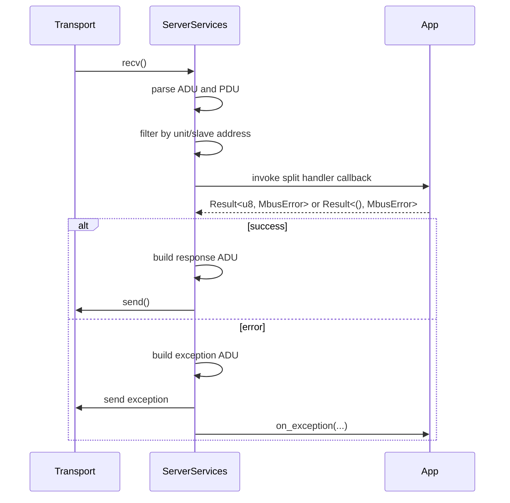

# Server Architecture

High-level structure of the synchronous server stack.

---

## Overview

```text
Your App <-> ServerServices <-> Transport
             |
             +-> framing, exception mapping, retry queue, request queue
             |
             +-> mbus-core protocol types and encoders
```

`ServerServices` is the orchestrator. It owns the transport, owns the application handler, receives frames, dispatches them, and manages retries or queueing when resilience features are enabled.

---

## Design Characteristics

| Property | Notes |
|----------|-------|
| Fixed-capacity buffers | Uses `heapless` rather than heap allocation |
| Poll-driven | No internal worker thread; progress happens inside `poll()` |
| Transport-agnostic | Works over TCP, RTU, ASCII, or a custom `Transport` |
| Split trait dispatch | Each functional area is isolated behind its own trait |
| `no_std` oriented internals | The core and server crates stay compatible with constrained targets |

---

## Main Roles

### `mbus-core`

Provides:

- protocol enums such as `FunctionCode`
- ADU and PDU framing helpers
- error types such as `MbusError` and `ExceptionCode`
- transport configuration and addressing types

### `mbus-server`

Provides:

- `ServerServices`
- split handler traits such as `ServerCoilHandler` and `ServerDiagnosticsHandler`
- resilience infrastructure
- derive-backed map traits and the `modbus_app` macros

### Transport crates

- `mbus-network` provides TCP transports
- `mbus-serial` provides RTU and ASCII transports

---

## Request Flow



The important current detail is that read handlers usually return a byte count after filling an output buffer, rather than returning a higher-level response object.

---

## Dispatch Surface

`ModbusAppHandler` is a composed trait, but real implementations usually come from the split traits:

- `ServerCoilHandler`
- `ServerDiscreteInputHandler`
- `ServerHoldingRegisterHandler`
- `ServerInputRegisterHandler`
- `ServerFifoHandler`
- `ServerFileRecordHandler`
- `ServerDiagnosticsHandler`
- `ServerExceptionHandler`
- `TrafficNotifier` when the feature is enabled

Function-code routing currently covers:

| Category | Function codes |
|----------|----------------|
| Coil access | FC01, FC05, FC0F |
| Discrete inputs | FC02 |
| Holding registers | FC03, FC06, FC10, FC16, FC17 |
| Input registers | FC04 |
| Diagnostics | FC07, FC08, FC0B, FC0C, FC11, FC2B/0x0E |
| File and FIFO | FC14, FC15, FC18 |

---

## Queueing And Retries

When configured, `ServerServices` keeps two fixed-capacity queues:

- a request queue for priority-ordered dispatch
- a response queue for failed sends that should be retried

Relevant knobs live in `ResilienceConfig`:

- `enable_priority_queue`
- `max_send_retries`
- `timeouts.response_retry_interval_ms`
- `timeouts.request_deadline_ms`
- `timeouts.overflow_policy`

Request priorities currently classify FC14 and FC18 as reads, FC15 and FC17 as writes, and FC2B as maintenance.

---

## Macro Architecture

The derive macros generate map traits, and `#[modbus_app]` turns those maps into server trait impls.

```text
#[derive(CoilsModel)]
    -> impl CoilMap
       - encode(address, quantity, out)
       - write_single(...)
       - write_many_from_packed(...)

#[derive(HoldingRegistersModel)]
    -> impl HoldingRegisterMap
       - encode(address, quantity, out)
       - write_single(...)
       - write_many(...)

#[modbus_app(...)]
    -> impl ServerCoilHandler / ServerHoldingRegisterHandler / ...
```

For `fifo(...)` and `file_record(...)`, the macro does selector-based routing instead of range routing:

- FIFO uses `POINTER_ADDRESS`
- file record uses `FILE_NUMBER`

---

## Memory Footprint

The server keeps its internal protocol buffers on fixed-capacity storage. Queue depth directly affects memory usage because queued requests and responses both scale with the `QUEUE_DEPTH` const generic.

The default constructor uses `QUEUE_DEPTH = 8`.

---

## See Also

- [Building Applications](building_applications.md)
- [Policies](policies.md)
- [Macros](macros.md)
